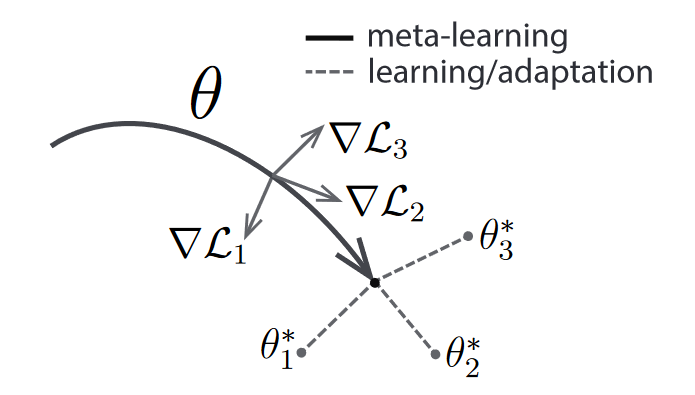

# Model-Agnostic Meta-Learning

In this assignment, you are going to implement a very popular meta-learning algorithm for deep neural networks, namely [Model-Agnostic Meta-Learning (MAML)](https://arxiv.org/pdf/1703.03400.pdf). 

In the assignment, we will apply MAML to the Sine Wave Regression task which was proposed by the authors of MAML. The goal of this problem setup is to learn new sine wave functions *quickly* (from very few examples). 
Every task corresponds to a sine function f(x) = amplitude * sin(x + phase), where amplitude and phase are drawn uniformly at random from the ranges [0.1, 5.0) and [0, pi) respectively. Moreover, every task consists of a *support set* and a *query set*. When presented with a task, the base-learner neural network is allowed to learn from the support set. The degree of success of this learning process is then measured on the examples query set. By attempting to minimize the loss on the query sets after a learning on the support set, an algorithm can learn to learn.

MAML does this in the following manner. It aims to learn a good set of initialization parameters for a base-learner from which we can quickly learn new tasks within just a few gradient descent updates, as shown in the image below. 

Here, theta denotes the parameters of our base-learner neural network, which attempts to model sine wave curves. This network has 1 input node, 2 hidden layers of 40 ReLU nodes, and a final output layer of 1 node. MAML attempts to *meta-learn* (find) parameters for this network, from which we can quickly *learn* new sine waves (represented by tasks 1, 2, and 3 in the image). In our case, learning corresponds to minimizing the MSE loss on the query set (after learning on the support set). 

Pseudocode for MAML, with a small improvement by [Antoniou et al. (2019)](https://arxiv.org/pdf/1810.09502.pdf) is shown below:
```
1. Randomly choose initialization weights theta
2. For every task T:
3.   Compute fast weights for T using S steps of gradient descent with base-learner learning rate LR_base on the support set
4.   Compute the loss of the resulting weights on the query set
5.   Make a single update step on the initialization parameters according to this loss with learning rate LR_meta 
```

S, LR_base, and LR_meta are the only hyperparameters that MAML has. 
